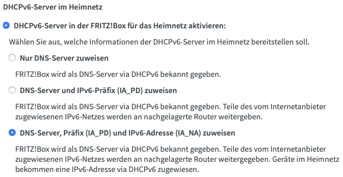

# Configure SSH over IPv6
In this guide we will configure SSH on a Raspberry Pi so that it can be reached via IPv6 even from an outside network. This is especially useful if your ISP only grants a Dual-Stack Lite connection.

## Raspberry Pi settings
At first we have to enable the Pis IPv6-module by editing the `/etc/modules` file:
```console
# sudo vim /etc/modules
```
Add the following line at the end of the file:
```console
ipv6
```
After a reboot you can check if your Raspberry now has an IPv6 address by calling the statement `ip a`. To make sure that your SSH client also accepts connections via IPv6 and not only via IPv4, we have to adjust the corresponding config file:
```console
# sudo vim /etc/ssh/sshd_config
```
Look for a line that begins with `AddressFamily` and make sure it is not set to `inet` (IPv4 use only). You can decide if you would like to enable IPv4 and IPv6 connections (by using `any`), or if you go for IPv6 connections only (`inet6`). I decided to enable both communication protocols, so that my line looks like this:
```console
AddressFamily any
```
If you like, you can also disable password authentification for SSH access, this would improve security by forcing clients to use SSH-keys instead. For further instructions on how to setup SSH-keys take a look [here](https://www.raspberrypi.org/documentation/remote-access/ssh/passwordless.md). To disable password authentification just set the following line in your `sshd_config`:
```console
PasswordAuthentication no
```

## Router settings
To make sure your internet router also works with IPv6 DS Lite and that it assigns global IPv6 addresses to your local devices (including your Raspberry Pi), some adjustments might have to be made *(Note: These settings depend on the router you use. I'm using an AVM Fritzbox, whose configuration can differ from your router)*.
At first I make sure my router uses a native IPv6-connection instead of IPv4 tunneling for IPv6 connectivity by setting the following in **Zugangsdaten -> IPv6**:

Afterwards we configure our DHCPv6 server in **Netzwerk -> Netzwerkeinstellungen -> IPv6 Adressen**, so that it assigns IPv6 addresses from your address range to the devices you are port forwarding, making them directly addressable from the internet:

**TODO: Describe port forwarding**
At this point you should be able to connect to your Raspberry Pi from the internet via SSH using the following command:
```console
# ssh -6 <user>@<global ipv6>
```
## Configure Dynamic DNS (optional)
By configuring DynDNS you can connect to your Raspberry by using a hostname instead of the complete IPv6 address. I'm using a hostname from [dynv6.com](https://dynv6.com) as they support IPv6, but of course you are free to choose a different service. After creating a hostname we have to make sure the hostname is always pointing at the current IPv6 address of the Pi. Therefor I wrote a small script based on a script from [dynv6.com](https://dynv6.com):
```console
#!/bin/sh -e
hostname=<yourhostname>
device=$2
token=<yourtoken>
file=$HOME/.dynv6.addr6
[ -e $file ] && old=`cat $file`

if [ -z "$netmask" ]; then
    netmask=128
fi

if [ -n "$device" ]; then
    device="dev $device"
fi
address=$(ip -6 addr list scope global $device | grep -v " fd" | sed -n 's/.*inet6 \([0-9a-f:]\+\).*/\1/p' | head -n 1)

if [ -e /usr/bin/curl ]; then
    bin="curl -fsS"
elif [ -e /usr/bin/wget ]; then
    bin="wget -O-"
else
    echo "neither curl nor wget found"
    exit 1
fi

if [ -z "$address" ]; then
    echo "no IPv6 address found"
    exit 1
fi

# address with netmask
current=$address/$netmask

if [ "$old" = "$current" ]; then
    echo "IPv6 address unchanged"
    exit
fi

# send addresses to dynv6
$bin "http://dynv6.com/api/update?hostname=$hostname&ipv6=$current&token=$token"
$bin "http://ipv4.dynv6.com/api/update?hostname=$hostname&ipv4=auto&token=$token"

# save current address
echo $current > $file
```
This script sends the latest IPv4 and IPv6 address to dynv6 if the adresses have changed, so that your hostname always points to the right direction. I have saved the script in my Raspberry Pis home directory in a file called dynv6.sh. Before we proceed, make sure you can execute the script:
```console
# chmod +x dynv6.sh
```
Now we can configure a cronjob that executes the script every 5 minutes, keeping the hostname updated:
```console
# crontab -e
```
Now add a line that looks like this:
```console
*/5 * * * * /path/to/dynv6.sh
```
Now you should be able to connect to your Raspberry by using `ssh -6 <user>@<your hostname>` instead of your IPv6 address only. You can also use your own subdomain name by configuring a CNAME record pointing to the DynDNS hostname in your DNS configuration.
